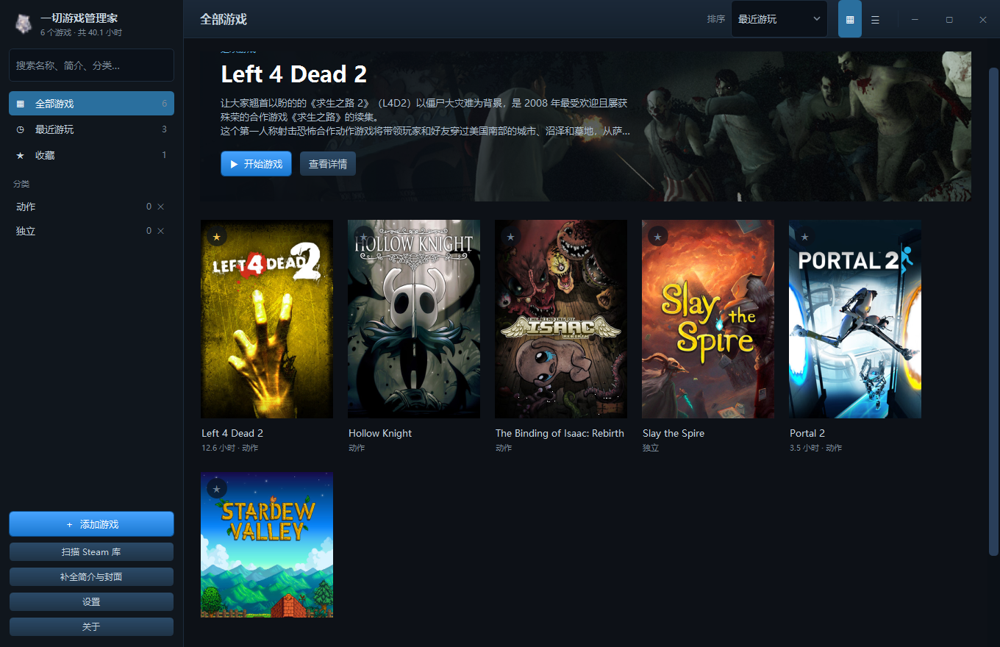
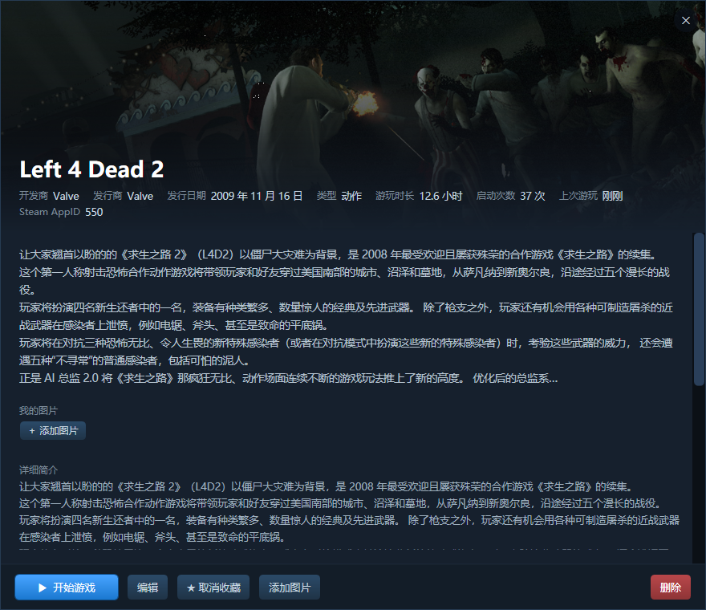

# 一切游戏管理家 · GameVault

一个本地运行的、Steam 风格的游戏库管理器。把散落在硬盘各处的游戏集中到一个界面里，
自动从网上抓取简介和封面，一键启动，按自己的分类整理，还支持自定义的图片 / MP4 动态壁纸。

原生 Windows 桌面程序（WPF / .NET 8），单文件打包，**自带运行库**，不需要安装 .NET 或任何其它东西。



<details>
<summary>游戏详情页</summary>



</details>

## 下载

到 [Releases](../../releases/latest) 页面下载，两个版本功能完全一样：

| 版本 | 文件 | 说明 |
| --- | --- | --- |
| **安装版** | [`GameVault-1.0.0-Setup.exe`](../../releases/latest) | 带简体中文安装向导，可创建开始菜单 / 桌面快捷方式，自带卸载程序。默认「仅为我安装」，不需要管理员权限 |
| **便携版** | [`GameVault-1.0.0-Portable.zip`](../../releases/latest) | 解压即用，不写注册表、不装任何东西。整个文件夹拷走就是迁移 |

> 安装包和便携版的文件名用英文（`Setup` / `Portable`），这是因为 GitHub 的
> Release 附件不支持中文文件名，上传后名字会丢失。程序本身是完整的简体中文界面。

## 功能

| 功能 | 说明 |
| --- | --- |
| 扫描 Steam 库 | 读取 Steam 自己的库文件（含 D 盘、F 盘等第二库），离线可用，批量导入已安装的游戏 |
| 手动添加 | 系统原生文件选择框，支持任意 `.exe` / `.lnk` / `.bat` |
| 自动获取简介 | Steam 上的游戏抓 Steam 中文简介；Steam 没收录的自动改用 VNDB、萌娘百科 |
| 简介自动中文化 | 抓到的简介若是英文 / 日文，先换名字再找一遍中文，仍找不到就调用机器翻译 |
| 自动封面 | 从 Steam 图床下载竖版封面和宽幅头图，非 Steam 游戏用 VNDB / SteamGridDB |
| 快捷启动 | 网格上的播放按钮、详情页的「开始游戏」都能直接启动 |
| 游玩时长 | 直接运行的程序会跟踪进程，退出后把时长累加到游戏记录，精确到秒 |
| 分类整理 | 自定义分类、收藏、最近游玩，支持搜索和四种排序、网格 / 列表两种视图 |
| 自己的图片 | 每个游戏可以添加任意多张截图 |
| 背景壁纸 | 支持 PNG / JPG / BMP / WEBP / GIF 图片，以及 **MP4 动态壁纸**（循环播放，分辨率需 ≥ 1280×720） |
| 窗口大小 | 可自由拖拽调整并记住；内置 720p / 1080p / 2K / 带鱼屏 / 4K 预设 |
| 后台运行 | 点 ✕ 时可选「每次询问 / 最小化到后台 / 直接退出」，收进系统托盘后游戏继续计时 |
| 开机自启动 | 一键写当前用户的启动项，不需要管理员权限，开机后直接进后台 |
| 全程自绘界面 | 无系统标题栏，统一的项目内关闭按钮，深色主题 |

## 数据存在哪里

- **便携版**：程序旁边的 `data\` 文件夹
- **安装版**：安装到 `Program Files` 时程序目录只读，数据自动改放
  `%APPDATA%\一切游戏管理家\data`

```
data/
  library.json   游戏记录、分类、游玩时长
  settings.json  代理、API Key、背景壁纸、窗口大小
  covers/        封面与头图
  shots/         你自己添加的图片
  wallpapers/    你导入的背景图片 / MP4
```

程序里的「关于」窗口会直接显示当前是哪种模式，以及数据的完整路径。
`library.json` 是纯文本，随时可以备份或手动改。删除仓库里的游戏**不会**删除游戏本体。

## 用到的第三方服务

全部是公开接口，**核心功能不需要任何 API Key**。

| 服务 | 用途 |
| --- | --- |
| Steam 公开接口 | 游戏搜索、中文简介、封面图床 |
| [VNDB](https://vndb.org) | 视觉小说的封面、开发商、发行日期 |
| [萌娘百科](https://zh.moegirl.org.cn) | 中文简介 |
| [SteamGridDB](https://www.steamgriddb.com) | 非 Steam 游戏的封面（可选，需自己的 Key） |
| 彩云小译 / 有道 / MyMemory | 机器翻译 |

游戏的名称、封面、简介等资料版权归各自权利人所有，本项目仅出于识别和介绍游戏的目的取用。

## 免责声明

- 本项目是免费的个人作品，按「现状」提供，不附带任何担保。
- 与 Valve、Steam 以及任何游戏开发商、发行商**均无关联**，也未获其授权或认可。
- 不提供、不下载、不分发任何游戏本体**，也不含任何破解或绕过正版验证的功能，
  只负责启动你自己电脑上已经存在的程序。
- 机器翻译结果仅供参考。
- 游戏库数据请自行备份，因误删或故障造成的数据丢失作者不承担责任。

完整声明见程序内的「关于」窗口。

## 作者

**雪村落雪 · deepseek**
